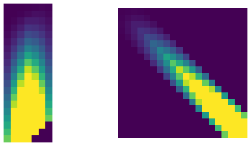

# genbmm



This library is a collection of missing matrix-multiply like operations for PyTorch. It was developed to provide operators needed for [PyTorch-Struct](https://github.com/harvardnlp/pytorch-struct). 

The library has currently has two components. It only supports CUDA operations.  

* Generalized matrix-multiplication with gradients (log-space, max, sample)
* Banded sparse matrices


## Quickstart 

```python
!pip install -qU git+https://github.com/harvardnlp/genbmm
```
### Generalized Matrix Multiplication

Computing matrix multiplies over non-standard semi-rings in PyTorch requires creating large intermediary terms with views. This is particularly bad because they are stored internally for backprop. This library implements some alternative matrix multiplies in CUDA to avoid this issue. 


```python

import genbmm

a = torch.rand(10, 3, 4).cuda().requires_grad_(True)
b = torch.rand(10, 4, 5).cuda().requires_grad_(True)

# Log-Sum-Exp
c = genbmm.logbmm(a, b)
# Equivalent
a = a.unsqueeze(-1)
b = b.unsqueeze(-3)
c2 = (a + b).logsumexp(-2)
# Grad
prob_a, prob_b = torch.autograd.grad(c.sum(), (a, b))

# Max
c = genbmm.maxbmm(a, b)
# Equivalent
a = a.unsqueeze(-1)
b = b.unsqueeze(-3)
c2, = (a + b).max(-2)
# Grad
argmax_a, argmax_b = torch.autograd.grad(c.sum(), (a, b))

# Sample
c = genbmm.samplebmm(a, b)
# Equivalent
a = a.unsqueeze(-1)
b = b.unsqueeze(-3)
c2 = (a + b).logsumexp(-2)
# Grad
sample_a, sample_b = torch.autograd.grad(c.sum(), (a, b))
# c2 = (a + b).softmax(-2).sample(-2)

# Product-Max
c = genbmm.prodmaxbmm(a, b)
# Equivalent
a = a.unsqueeze(-1)
b = b.unsqueeze(-3)
c2, = (a * b).max(-2)
# Grad
grad_a, grad_b = torch.autograd.grad(c.sum(), (a, b))
```

### Banded Sparse Matrices

See https://nbviewer.jupyter.org/github/harvardnlp/genbmm/blob/master/notebooks/Sparse.ipynb. 


